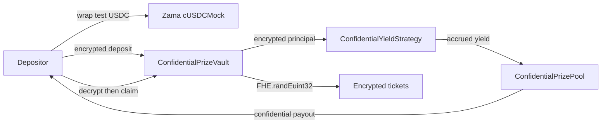

# Cube

Cube is a confidential no-loss prize-savings dApp on Ethereum Sepolia. Users deposit principal, pooled capital earns
yield, deposit-weighted draws award only that yield, and principal stays withdrawable. Zama FHEVM keeps balances, TWAB
weights, random tickets, results, and payouts encrypted onchain.

> Unaudited testnet demo. Yield is a fixed 5% annual rate against a funded encrypted reserve, not a production lending
> adapter.

- **Live app:** [https://cube-nu-nine.vercel.app/](https://cube-nu-nine.vercel.app/)
- **Video demo:** [https://www.loom.com/share/de439f34bd9746d699122e9438f0cd56](https://www.loom.com/share/de439f34bd9746d699122e9438f0cd56)

```text
pool/
├── contracts/   # Hardhat, Solidity, keeper, tests
└── frontend/    # Next.js + RainbowKit + Zama relayer
```

## Architecture



## Sepolia contracts

Verified source on Etherscan:

| Contract                    | Address                                                                                                                             |
| --------------------------- | ----------------------------------------------------------------------------------------------------------------------------------- |
| `ConfidentialPrizeVault`    | [`0x4294f12aE993561B5b6e966A653468f59cC9C39f`](https://sepolia.etherscan.io/address/0x4294f12aE993561B5b6e966A653468f59cC9C39f#code) |
| `ConfidentialPrizePool`     | [`0x538011b9aF6C295c3b3225C252A4176ef26a248f`](https://sepolia.etherscan.io/address/0x538011b9aF6C295c3b3225C252A4176ef26a248f#code) |
| `ConfidentialYieldStrategy` | [`0xE0e8856a06C4583c45709f0E52AF3230978F1C9E`](https://sepolia.etherscan.io/address/0xE0e8856a06C4583c45709f0E52AF3230978F1C9E#code) |
| Zama `cUSDCMock`            | [`0x7c5BF43B851c1dff1a4feE8dB225b87f2C223639`](https://sepolia.etherscan.io/address/0x7c5BF43B851c1dff1a4feE8dB225b87f2C223639)     |
| Public test USDC            | [`0x9b5Cd13b8eFbB58Dc25A05CF411D8056058aDFfF`](https://sepolia.etherscan.io/address/0x9b5Cd13b8eFbB58Dc25A05CF411D8056058aDFfF)     |

Zama token registry: [Sepolia addresses](https://github.com/zama-ai/protocol-apps/blob/main/docs/addresses/testnet/sepolia.md).

## How it works

1. Open a five-minute draw, mint/shield test USDC, authorize the vault, and deposit privately.
2. Fund the encrypted yield reserve. Accrued yield becomes the prize; principal is never raffled.
3. `closeDraw()` harvests remaining yield, freezes TWAB, and generates encrypted FHE tickets onchain.
4. Settlement scores 50%/30%/20% tiers. Decrypt your result, claim, or withdraw principal anytime.

## Local development

Node.js 22 LTS (not 23).

```bash
cd contracts && npm install && npm test
cd ../frontend && npm install && npm run dev
```

```bash
cd contracts
cp .env.example .env
npm run deploy:sepolia -- --tags Pool
npm run verify:sepolia <address> [constructor args...]
```

```bash
cd frontend
cp .env.example .env.local
```

```dotenv
NEXT_PUBLIC_VAULT_ADDRESS=0x4294f12aE993561B5b6e966A653468f59cC9C39f
NEXT_PUBLIC_YIELD_STRATEGY_ADDRESS=0xE0e8856a06C4583c45709f0E52AF3230978F1C9E
NEXT_PUBLIC_WALLETCONNECT_PROJECT_ID=...
NEXT_PUBLIC_SEPOLIA_RPC_URL=https://...
```

Create a project ID in [WalletConnect Cloud](https://cloud.walletconnect.com/). RainbowKit handles wallet discovery and
Sepolia switching. The connected wallet transport is reused by ethers and Zama's relayer SDK for encrypted inputs and
EIP-712 user decryption.

Judge flow:

`connect Sepolia → mint → shield → authorize → deposit → fund reserve → wait → automatic harvest + FHE close → settle → decrypt → claim → withdraw`

### Automated keeper

The repository includes a long-running keeper. It opens the first draw when needed, watches block timestamps, closes
each expired draw with onchain FHE randomness, and submits bounded settlement batches until every pending draw settles.
The frontend keeper console remains available as a manual fallback.

After deploying, add these values to `contracts/.env`:

```dotenv
VAULT_ADDRESS=0x...
KEEPER_PRIVATE_KEY=0x...
KEEPER_CHAIN_ID=11155111
KEEPER_POLL_INTERVAL_MS=30000
KEEPER_SETTLEMENT_BATCH_SIZE=16
KEEPER_MAX_BATCHES_PER_TICK=4
```

Use a separate, minimally funded Sepolia keeper account. It needs only Sepolia ETH for gas and receives no privileged
contract role. Never expose its key through the frontend.

```bash
cd contracts
npm run keeper
```

Run that command as a persistent background worker on the same hosting provider as the frontend or another process
host. The process logs every submitted and confirmed transaction and retries from current onchain state after transient
failures or restarts. For an external cron scheduler, `npm run keeper:once` performs one idempotent cycle and exits with
a failure code if the cycle fails.

`closeDraw()` always harvests remaining yield atomically before sizing the prize, so automation cannot accidentally
skip it. The frontend's **Harvest accrued yield now** action and `KEEPER_HARVEST_BEFORE_CLOSE=true` remain optional ways
to demonstrate an earlier harvest. A draw still has no prize unless its reserve was funded or it received a sponsored
contribution.

#### Free GitHub Actions scheduler

`.github/workflows/keeper.yml` runs `keeper:once` every five minutes and also supports manual dispatch. In the public
GitHub repository, add these encrypted repository secrets under **Settings → Secrets and variables → Actions**:

- `KEEPER_PRIVATE_KEY`: a dedicated gas-only wallet key;
- `SEPOLIA_RPC_URL`: an HTTPS Sepolia RPC endpoint.

The public V8 vault address is pinned in the workflow as `VAULT_ADDRESS`; update that workflow value whenever a new
vault version is deployed.

Fund the keeper address with Sepolia ETH, push the workflow to the default branch, open the repository's **Actions**
tab, and manually run **Sepolia Prize Keeper** once to verify its logs. The scheduled job opens, closes, and settles
draws without a laptop. GitHub schedules can be delayed, so a draw may remain expired for a few minutes before the next
transaction; the frontend buttons remain the fallback.

Because harvest and close are atomic, GitHub's five-minute scheduling granularity does not create an unfunded-close
race. The action may execute a few minutes after the displayed expiry, but its transaction harvests, closes, generates
FHE tickets, and opens the next draw before settlement begins.

## Privacy and information leakage

Encrypted onchain:

- confidential wallet balance, vault principal, aggregate principal, per-user and aggregate TWAB;
- strategy principal/reserve/accrual and Prize Pool liquidity;
- FHE random values, weighted tickets, settlement cursor, winner flags, tier prizes, and user payouts.

Intentionally public:

- account addresses, participant registry/count, transaction senders/timing/gas, draw schedule/state, and settlement
  progress;
- public test-USDC mint, approval, and wrap amounts before the confidential boundary;
- that an address requests decryption offchain and/or submits a claim transaction. Claim timing can correlate activity,
  although the transferred amount and whether it is zero remain encrypted.

Fairness is publicly auditable from deployed bytecode/source, the `closeDraw()` transaction, FHE operation handles,
events, and Zama protocol execution. Unlike a public VRF, the random word is not disclosed: unpredictability and correct
encrypted execution rely on Zama's protocol and threshold infrastructure. Only each participant receives ACL permission
to decrypt their own zero-or-prize result.

## Error handling

- RainbowKit prompts for Sepolia and exposes account/network state.
- The UI requires vault/strategy ERC-7984 authorization before deposit or reserve funding.
- Public approval and shielding are separate confirmed transactions; insufficient public test USDC is reported.
- Zero/negative inputs are rejected client-side.
- Draw countdown/state errors, duplicate claims, missing participation, relayer failures, and rejected EIP-712
  signatures are surfaced as wallet notifications/toasts.
- Confidential insufficient deposit/withdraw amounts cannot safely revert based on a secret. ERC-7984 masks a failed
  confidential transfer, and over-withdrawal deliberately transfers encrypted zero.

## Keeper

`contracts/keeper` and `.github/workflows/keeper.yml` open, harvest+close, and settle draws. Use a gas-only Sepolia
key as `KEEPER_PRIVATE_KEY`. The workflow also needs `SEPOLIA_RPC_URL`. Frontend keeper buttons remain a manual fallback.

## Privacy

Encrypted: balances, TWAB, tickets, prizes, payouts. Public: addresses, timing, draw state, wrap amounts before the
confidential boundary. See [SECURITY.md](SECURITY.md).

## References

- [Zama FHEVM](https://docs.zama.ai/fhevm)
- [Zama FHE randomness](https://docs.zama.ai/fhevm/smart-contract/random)
- [OpenZeppelin confidential contracts](https://github.com/OpenZeppelin/openzeppelin-confidential-contracts)
- [PoolTogether](https://pooltogether.com/)

## License

BSD-3-Clause-Clear. See [LICENSE](LICENSE).
