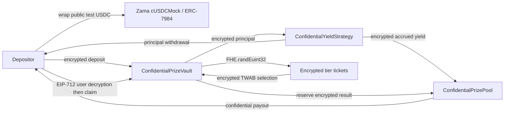

# Cube

Cube is a confidential no-loss prize-savings dApp for Ethereum Sepolia. It preserves PoolTogether's core mechanic:
users deposit principal, pooled capital generates yield, periodic deposit-weighted draws award only that yield, and
principal remains withdrawable. Zama FHEVM keeps balances, TWAB weights, random tickets, results, and payouts encrypted
onchain.

> Cube is an unaudited testnet demonstration. Its strategy models yield at a fixed 5% annual rate against an
> admin/user-funded encrypted reserve. A real deployment would replace that strategy with an audited lending adapter.

- **Live app:** [https://cube-nu-nine.vercel.app/](https://cube-nu-nine.vercel.app/)
- **Video demo:** [https://www.loom.com/share/de439f34bd9746d699122e9438f0cd56](https://www.loom.com/share/de439f34bd9746d699122e9438f0cd56)

```text
pool/
├── contracts/   # Hardhat, Solidity, deployment, keeper, and FHE mock tests
└── frontend/    # Next.js, RainbowKit, wagmi, ethers, and Zama relayer SDK
```

## Architecture



| Component                   | Responsibility                                                                                   |
| --------------------------- | ------------------------------------------------------------------------------------------------ |
| `ConfidentialPrizeVault`    | Encrypted principal/TWAB accounting, FHE randomness, weighted selection, claims, and withdrawals |
| `ConfidentialPrizePool`     | Separate encrypted prize custody, reservation at settlement, and confidential claim payments     |
| `ConfidentialYieldStrategy` | Encrypted principal custody, reserve-backed mock yield, harvest, and withdrawals                 |
| Zama `cUSDCMock`            | Existing Sepolia ERC-7984 confidential wrapper; Cube does not deploy a new confidential token    |
| `contracts/keeper`          | Self-hosted permissionless draw closer and encrypted batch settler                               |
| `frontend`                  | RainbowKit wallet UX, encrypted inputs, EIP-712 user decryption, claims, and keeper controls     |

### Sepolia deployment (V8)

| Contract                    | Address                                      |
| --------------------------- | -------------------------------------------- |
| `ConfidentialPrizeVault`    | `0x4294f12aE993561B5b6e966A653468f59cC9C39f` |
| `ConfidentialPrizePool`     | `0x538011b9aF6C295c3b3225C252A4176ef26a248f` |
| `ConfidentialYieldStrategy` | `0xE0e8856a06C4583c45709f0E52AF3230978F1C9E` |
| Zama `cUSDCMock`            | `0x7c5BF43B851c1dff1a4feE8dB225b87f2C223639` |
| Public test USDC            | `0x9b5Cd13b8eFbB58Dc25A05CF411D8056058aDFfF` |

## End-to-end flow

1. Anyone opens the first five-minute draw.
2. A user mints public test USDC, approves and wraps it into Zama's `cUSDCMock`, and grants time-limited ERC-7984
   operator access to the vault and strategy.
3. The browser encrypts the deposit for the vault. Principal moves to the strategy and the vault updates encrypted
   principal and time-weighted-average-balance observations.
4. A sponsor funds the encrypted mock-yield reserve. Reserve funding backs future simulated interest; it does not
   directly become the prize. Yield accrues from encrypted managed principal and time.
5. Once the interval expires, anyone calls `closeDraw()`. That single transaction harvests all remaining accrued yield
   into the Prize Pool, freezes encrypted total TWAB, and calls `FHE.randEuint32()` three times. Each encrypted random
   fraction is scaled into `[0, totalTWAB)` using encrypted multiplication and shifting. Neither randomness nor balances
   are sent offchain or revealed.
6. Closing immediately opens the next interval, so deposits and withdrawals do not wait for settlement.
7. A keeper calls `settleBatch(drawId, 16)` until all registered accounts are processed. Each of the 50%/30%/20%
   tiers independently selects an encrypted TWAB-weighted interval. Results are encrypted zero-or-prize values.
8. A participant signs the Zama relayer's EIP-712 user-decryption request to privately see their result. They then
   call `claim(drawId)`; the Prize Pool makes a confidential ERC-7984 transfer of that already-reserved result.
9. `withdraw()` remains available in every draw state and while paused. An excessive request becomes encrypted zero,
   avoiding a balance-dependent public revert.

Multiple tiers may choose the same participant in one draw. If a draw has no positive TWAB, its unawarded
encrypted prize rolls into the next open draw.

## Local development

Use Node.js 22 LTS; Hardhat does not support Node 23.

```bash
cd contracts
npm install
npm run compile
npm test
npm run lint

cd ../frontend
npm install
npm run lint
npm run build
```

For a local node, use separate terminals:

```bash
cd contracts
npm run chain
```

```bash
cd contracts
npm run deploy:localhost
```

The FHE Hardhat mock implements encrypted randomness, so no VRF coordinator or fulfillment transaction is needed.

## Sepolia contracts

Cube uses Zama's published Sepolia assets:

| Asset                        | Address                                      |
| ---------------------------- | -------------------------------------------- |
| `cUSDCMock` ERC-7984 wrapper | `0x7c5BF43B851c1dff1a4feE8dB225b87f2C223639` |
| Mintable test USDC           | `0x9b5Cd13b8eFbB58Dc25A05CF411D8056058aDFfF` |

Source: [Zama Sepolia address registry](https://github.com/zama-ai/protocol-apps/blob/main/docs/addresses/testnet/sepolia.md).
The frontend's **Mint 1,000 test USDC** button is the judge faucet. It calls the published mock token's `mint` method.

Create the deployer environment file:

```bash
cd contracts
cp .env.example .env
```

Set `DEPLOYER_PRIVATE_KEY`, either `INFURA_API_KEY`, `ALCHEMY_API_KEY`, or `SEPOLIA_RPC_URL`, and optionally
`ETHERSCAN_API_KEY`. Use a dedicated, minimally funded Sepolia key. The key may include or omit `0x`; it is Git-ignored
and must never appear in a frontend or `NEXT_PUBLIC_*` variable. `DRAW_DURATION_SECONDS` defaults to the minimum demo
interval of 300 seconds and accepts up to 2,592,000 seconds.

```bash
npm run deploy:sepolia -- --tags Pool
```

The deployment validates the official token addresses, deploys the strategy, Prize Pool, and vault, and performs their
one-time wiring. No Chainlink subscription or callback is required.

## Frontend

```bash
cd frontend
cp .env.example .env.local
npm install
npm run dev
```

```dotenv
NEXT_PUBLIC_VAULT_ADDRESS=0x...
NEXT_PUBLIC_YIELD_STRATEGY_ADDRESS=0x...
NEXT_PUBLIC_WALLETCONNECT_PROJECT_ID=...
NEXT_PUBLIC_SEPOLIA_RPC_URL=https://...
```

Create a project ID in [WalletConnect Cloud](https://cloud.walletconnect.com/). RainbowKit handles wallet discovery and
Sepolia switching. The connected wallet transport is reused by ethers and Zama's relayer SDK for encrypted inputs and
EIP-712 user decryption.

Judge flow:

`connect Sepolia → mint → shield → authorize → deposit → fund reserve → wait → automatic harvest + FHE close → settle → decrypt → claim → withdraw`

### Automated keeper

The repository includes a long-running keeper. It opens the first draw when needed, watches block timestamps, closes
each expired draw with onchain FHE randomness, and submits bounded settlement batches until every pending draw settles.
The frontend keeper console remains available as a manual fallback.

After deploying, add these values to `contracts/.env`:

```dotenv
VAULT_ADDRESS=0x...
KEEPER_PRIVATE_KEY=0x...
KEEPER_CHAIN_ID=11155111
KEEPER_POLL_INTERVAL_MS=30000
KEEPER_SETTLEMENT_BATCH_SIZE=16
KEEPER_MAX_BATCHES_PER_TICK=4
```

Use a separate, minimally funded Sepolia keeper account. It needs only Sepolia ETH for gas and receives no privileged
contract role. Never expose its key through the frontend.

```bash
cd contracts
npm run keeper
```

Run that command as a persistent background worker on the same hosting provider as the frontend or another process
host. The process logs every submitted and confirmed transaction and retries from current onchain state after transient
failures or restarts. For an external cron scheduler, `npm run keeper:once` performs one idempotent cycle and exits with
a failure code if the cycle fails.

`closeDraw()` always harvests remaining yield atomically before sizing the prize, so automation cannot accidentally
skip it. The frontend's **Harvest accrued yield now** action and `KEEPER_HARVEST_BEFORE_CLOSE=true` remain optional ways
to demonstrate an earlier harvest. A draw still has no prize unless its reserve was funded or it received a sponsored
contribution.

#### Free GitHub Actions scheduler

`.github/workflows/keeper.yml` runs `keeper:once` every five minutes and also supports manual dispatch. In the public
GitHub repository, add these encrypted repository secrets under **Settings → Secrets and variables → Actions**:

- `KEEPER_PRIVATE_KEY`: a dedicated gas-only wallet key;
- `SEPOLIA_RPC_URL`: an HTTPS Sepolia RPC endpoint.

The public V8 vault address is pinned in the workflow as `VAULT_ADDRESS`; update that workflow value whenever a new
vault version is deployed.

Fund the keeper address with Sepolia ETH, push the workflow to the default branch, open the repository's **Actions**
tab, and manually run **Sepolia Prize Keeper** once to verify its logs. The scheduled job opens, closes, and settles
draws without a laptop. GitHub schedules can be delayed, so a draw may remain expired for a few minutes before the next
transaction; the frontend buttons remain the fallback.

Because harvest and close are atomic, GitHub's five-minute scheduling granularity does not create an unfunded-close
race. The action may execute a few minutes after the displayed expiry, but its transaction harvests, closes, generates
FHE tickets, and opens the next draw before settlement begins.

## Privacy and information leakage

Encrypted onchain:

- confidential wallet balance, vault principal, aggregate principal, per-user and aggregate TWAB;
- strategy principal/reserve/accrual and Prize Pool liquidity;
- FHE random values, weighted tickets, settlement cursor, winner flags, tier prizes, and user payouts.

Intentionally public:

- account addresses, participant registry/count, transaction senders/timing/gas, draw schedule/state, and settlement
  progress;
- public test-USDC mint, approval, and wrap amounts before the confidential boundary;
- that an address requests decryption offchain and/or submits a claim transaction. Claim timing can correlate activity,
  although the transferred amount and whether it is zero remain encrypted.

Fairness is publicly auditable from deployed bytecode/source, the `closeDraw()` transaction, FHE operation handles,
events, and Zama protocol execution. Unlike a public VRF, the random word is not disclosed: unpredictability and correct
encrypted execution rely on Zama's protocol and threshold infrastructure. Only each participant receives ACL permission
to decrypt their own zero-or-prize result.

## Error handling

- RainbowKit prompts for Sepolia and exposes account/network state.
- The UI requires vault/strategy ERC-7984 authorization before deposit or reserve funding.
- Public approval and shielding are separate confirmed transactions; insufficient public test USDC is reported.
- Zero/negative inputs are rejected client-side.
- Draw countdown/state errors, duplicate claims, missing participation, relayer failures, and rejected EIP-712
  signatures are surfaced as wallet notifications/toasts.
- Confidential insufficient deposit/withdraw amounts cannot safely revert based on a secret. ERC-7984 masks a failed
  confidential transfer, and over-withdrawal deliberately transfers encrypted zero.

## Tests and production status

The FHE mock suite covers private deposits and ACL denial, bounded encrypted random tickets, TWAB-weighted tier payouts,
yield reservation and explicit claim, continuous next-draw deposits, rollover, no-loss withdrawals, masked
over-withdrawals, and withdrawals while paused.

Before calling the submission production-ready, the repository must also have verified Sepolia contracts, a public
GitHub URL, and a publicly accessible frontend URL. For real-value deployment, replace the mock strategy, bound
lifetime participant/observation growth, transfer ownership to a timelocked multisig, add monitoring and incident
procedures, and obtain independent audits.

See [SECURITY.md](SECURITY.md) for detailed assumptions and limitations.

## References

- [Zama FHE randomness](https://docs.zama.ai/fhevm/smart-contract/random)
- [Zama relayer EIP-712 user decryption](https://docs.zama.ai/protocol/relayer-sdk-guides/fhevm-relayer/decryption/user-decryption)
- [Zama FHEVM documentation](https://docs.zama.ai/fhevm)
- [OpenZeppelin confidential contracts](https://github.com/OpenZeppelin/openzeppelin-confidential-contracts)
- [PoolTogether](https://pooltogether.com/)

## License

BSD-3-Clause-Clear. See [LICENSE](LICENSE).
